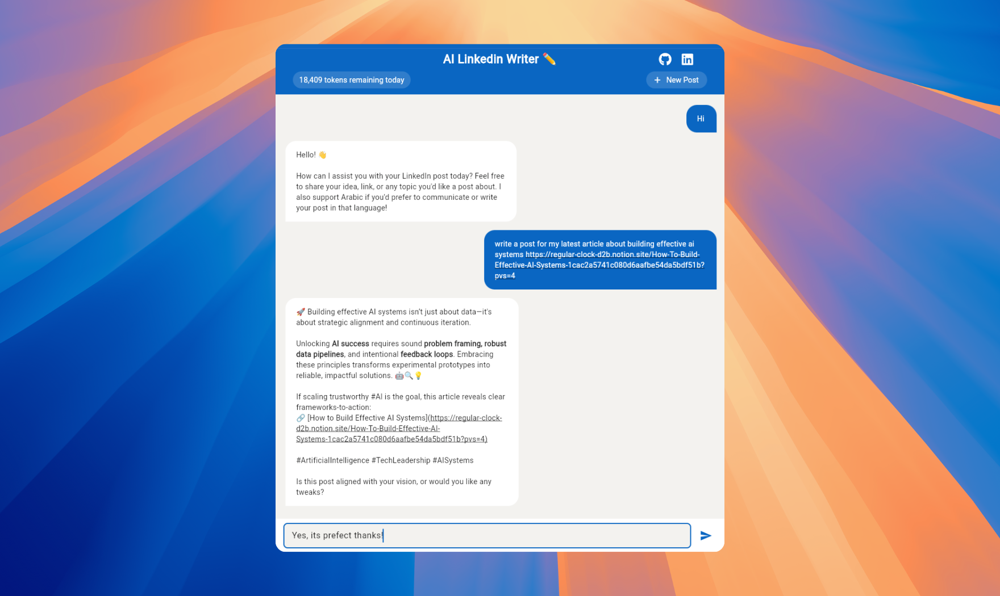

# AI Linkedin Writer

<div align="center">
  <table>
    <tr>
      <td>
        
      </td>
      <td>
        <div>
          
          
          
          
          <p>An AI-powered LinkedIn post generator built with Flutter Web and OpenAI’s GPT-5. This chatbot helps users instantly transform rough thoughts into clear, professional LinkedIn content.</p>
        </div>
      </td>
    </tr>
  </table>
</div>



## Features

- 💬 **Chat Interface**: User-friendly chat UI for seamless interaction
- 🤖 **AI-Powered Writing**: Uses OpenAI's latest GPT-5 model for high-quality content generation
- 📊 **Token Usage Tracking**: Monitor your API usage
- 🔒 **Secure API Management**: Firebase Functions for secure API calls
- 📱 **Responsive Layout**: Works on both desktop and mobile browsers
- 🛡️ **Error Monitoring**: Integrated with Sentry for real-time error tracking in production

## 🚀 Demo

Try the live app: [https://isl270.github.io/ai-linkedin-writer/](https://isl270.github.io/ai-linkedin-writer/)

## Prerequisites

- Flutter SDK (^3.7.2)
- Node.js (v18 or higher)
- Firebase CLI (`npm install -g firebase-tools`)
- OpenAI API key
- Firebase project

## Required Environment Variables

Set these environment variables for full functionality:

| Variable          | Where to set                                   | Example Value         |
|-------------------|-----------------------------------------------|-----------------------|
| `OPENAI_API_KEY`  | `functions/.env` & Firebase Functions Secret  | sk-...yourkey...      |
| `FIREBASE_CONFIG` | Generated by `flutterfire configure`           | (auto-generated)      |

- Example for `functions/.env`:
  ```env
  OPENAI_API_KEY=sk-your-openai-key-here
  ```
- Set Firebase Functions secret:
  ```bash
  firebase functions:secrets:set OPENAI_API_KEY
  ```

## Setup Instructions

### Sentry Error Tracking (Production)

This project uses [Sentry](https://sentry.io/) to track errors in production builds.

**Setup:**
1. Create a Sentry account and a new project for Flutter.
2. Copy your Sentry DSN.
3. Open `lib/app/core/config/sentry_config.dart` and replace `YOUR_SENTRY_DSN_HERE` with your actual DSN string.
   - **Do NOT commit real DSNs to public repositories.**
4. Sentry is automatically initialized in `main.dart` for production builds.

For more details, see the [Sentry Flutter docs](https://docs.sentry.io/platforms/flutter/).

### 1. Clone the Repository

```bash
git clone https://github.com/ISL270/ai-linkedin-writer.git
cd ai-linkedin-writer
```

### 2. Flutter Setup

1. Install Flutter dependencies:
```bash
flutter pub get
```

2. Create Firebase configuration:
```bash
flutterfire configure
```
This will generate `lib/firebase_options.dart` with your Firebase project settings.

### 3. Firebase Functions Setup

1. Navigate to the functions directory:
```bash
cd functions
```

2. Install Node.js dependencies:
```bash
npm install
```

3. Create a `.env` file in the `functions` directory:
```bash
echo "OPENAI_API_KEY=your_openai_api_key_here" > .env
```

4. Set up Firebase Functions environment:
```bash
firebase functions:secrets:set OPENAI_API_KEY
```
When prompted, enter your OpenAI API key.

5. Deploy the Firebase Function:
```bash
firebase deploy --only functions
```

### 4. Update Function URL

After deploying, you'll receive a Function URL. Update this URL in:
`lib/app/core/services/openai_service.dart`

Replace the `_functionUrl` value with your new function URL.

## Deploying to GitHub Pages

To deploy your application to GitHub Pages, follow these steps:

1. Create a new branch for your deployment.
2. Run the following command to build your web application:
```bash
flutter build web
```
3. Create a new folder in your repository's root directory called `docs`.
4. Move the contents of the `build/web` directory to the `docs` directory.
5. Commit your changes and push them to your repository.
6. Go to your repository's settings and select "Pages" from the left-hand menu.
7. Select the branch you created earlier and the `/docs` folder as the source.
8. Click "Save" to deploy your application to GitHub Pages.

## Running the Application

```bash
flutter run -d chrome
```

## Security Notes

- **Never commit secrets or API keys** (e.g., `.env`, API keys, Firebase credentials) to version control.
- Sensitive files like `.env` and `firebase_options.dart` are listed in [.gitignore](./.gitignore).
- Use environment variables for all sensitive data and configuration.
- If you accidentally commit a secret, rotate it immediately and remove it from your git history.

## Project Structure

```
lib/
├── main.dart              # Application entry point
├── app/
│   ├── core/             # Shared core functionality
│   │   ├── models/       # Base models
│   │   ├── utils/        # Utility functions
│   │   └── constants/    # App constants
│   ├── features/         # Application features
│   │   ├── feature_name/ # Each feature module
│   │   │   ├── data/    # Data layer
│   │   │   ├── domain/  # Business logic
│   │   │   └── presentation/ # UI layer
│   └── widgets/         # Shared widgets
```

## Contributing

1. Create a new branch for your feature
2. Make your changes
3. Submit a pull request

## License

This project is licensed under the MIT License - see the LICENSE file for details.
